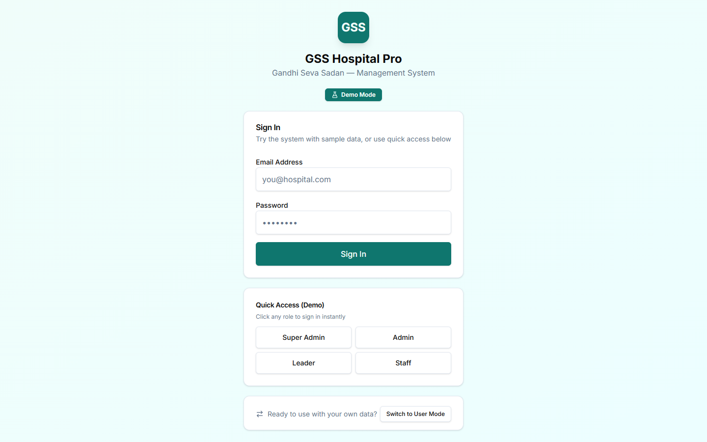
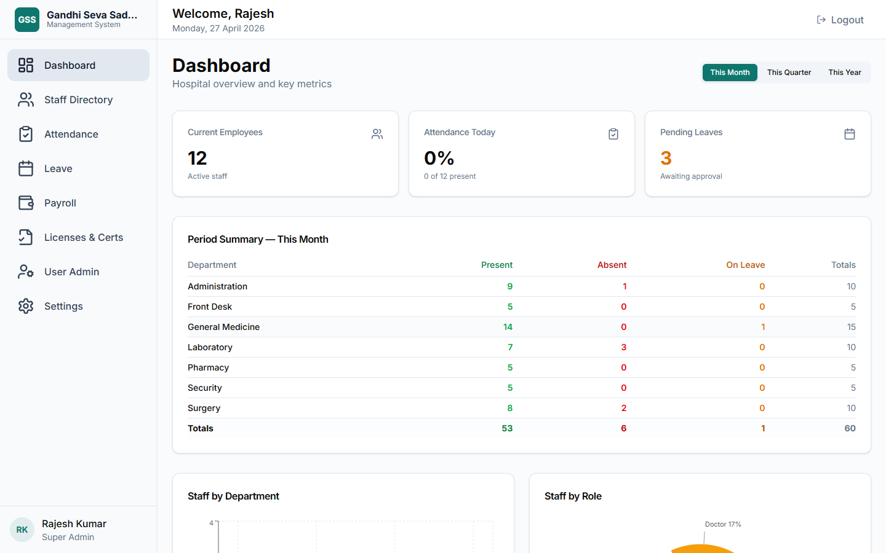
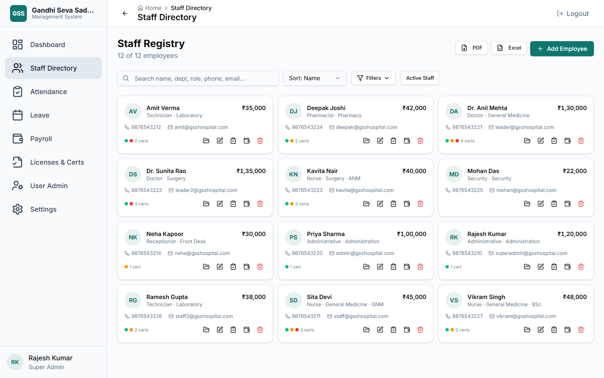
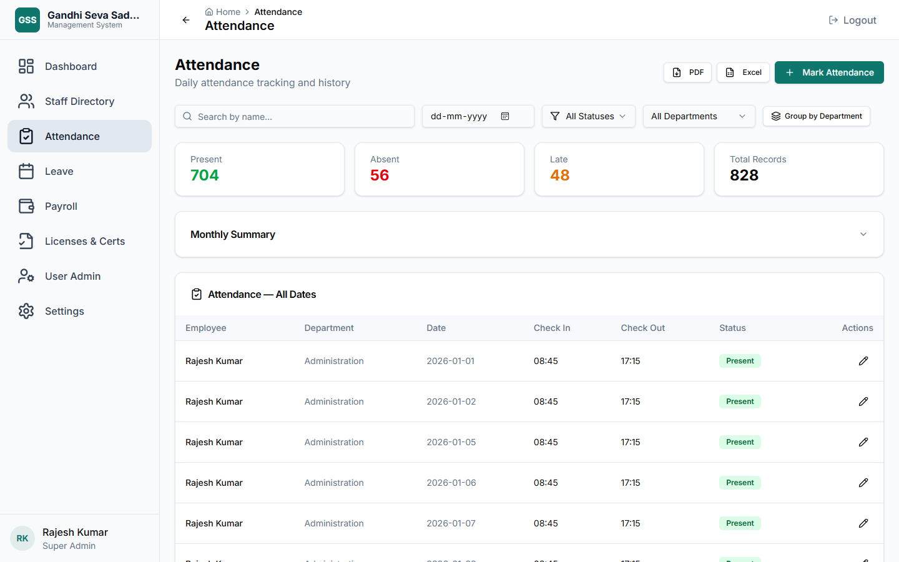
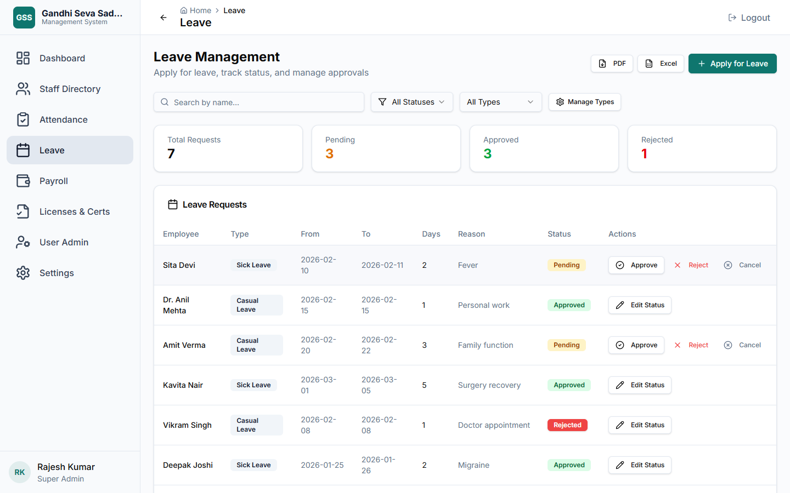
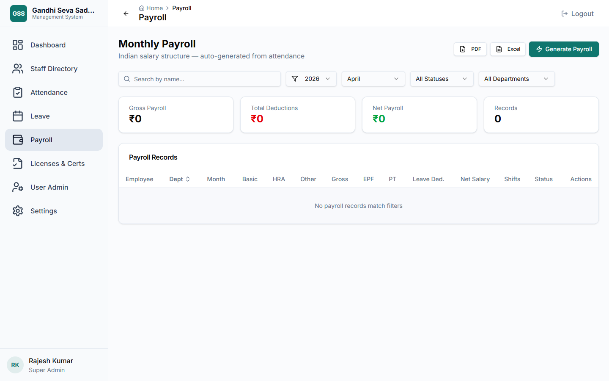
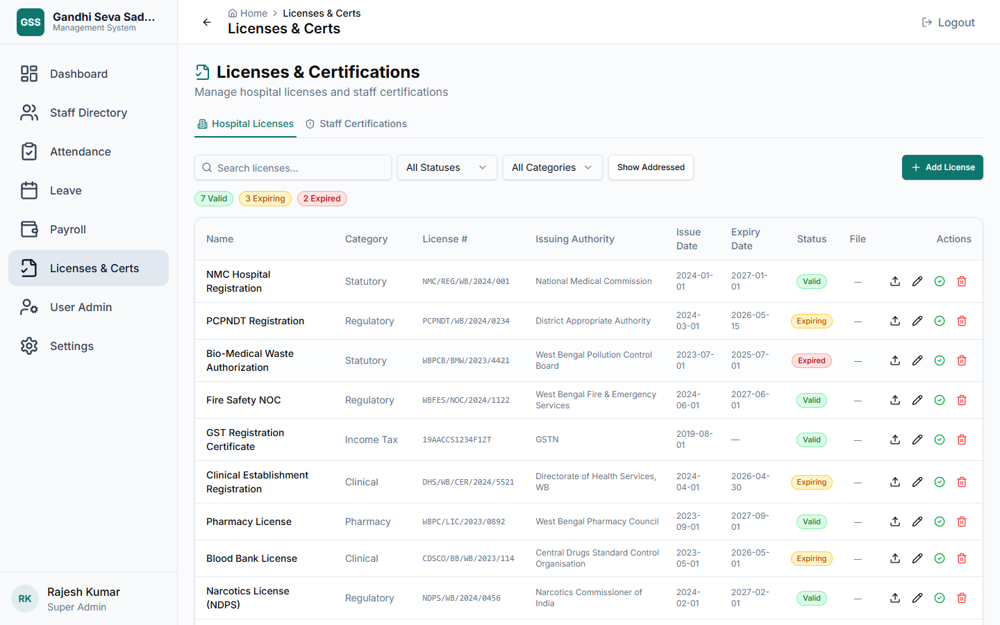
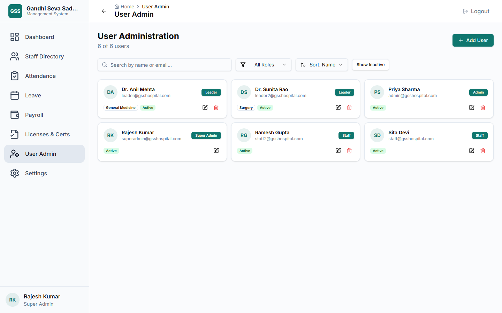
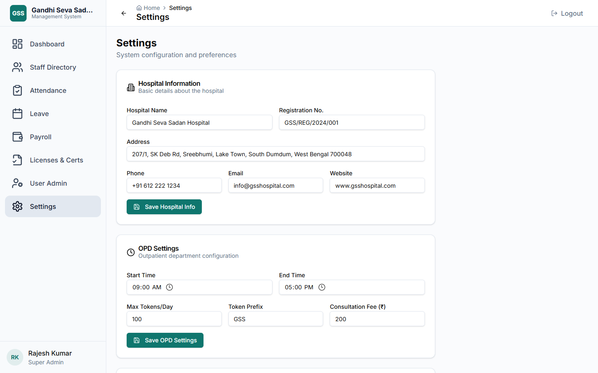

# GSS Hospital Pro

**Gandhi Seva Sadan — Hospital Management System**

A fully self-contained, offline-first Hospital Management System built for Windows. No internet connection, no cloud subscription, no external dependencies after the first run. Everything — the API server, the database, and the frontend — runs locally from a single folder.

---

## Screenshots

| Login | Dashboard |
|:-----:|:---------:|
|  |  |

| Staff Directory | Attendance |
|:--------------:|:----------:|
|  |  |

| Leave Management | Payroll |
|:----------------:|:-------:|
|  |  |

| Licenses & Certifications | User Management | Settings |
|:-------------------------:|:---------------:|:--------:|
|  |  |  |

---

## Table of Contents

1. [Quick Start](#quick-start)
2. [LAN / Multi-Device Access](#lan--multi-device-access)
3. [Default Login Accounts](#default-login-accounts)
4. [Role & Permission System](#role--permission-system)
5. [Feature Guide](#feature-guide)
   - [Dashboard](#1-dashboard)
   - [Staff Registry](#2-staff-registry)
   - [Attendance](#3-attendance)
   - [Leave Management](#4-leave-management)
   - [Payroll](#5-payroll)
   - [Licenses & Certifications](#6-licenses--certifications)
   - [User Administration](#7-user-administration)
   - [Settings](#8-settings)
6. [Data & File Storage](#data--file-storage)
7. [Technology Stack](#technology-stack)
8. [Project Structure](#project-structure)
9. [Development Setup](#development-setup)
10. [Building & Deploying](#building--deploying)
11. [System Requirements](#system-requirements)
12. [Troubleshooting](#troubleshooting)

---

## Quick Start

### First Time Only — Unblock Files

If you received this app as a ZIP download, Windows marks all extracted files as potentially unsafe.

**Run `Unblock Files (Run This First).bat` once** — right-click → **Run as administrator**. This removes the mark from all files. You only need to do this once.

> Skip this step if the folder arrived via USB drive or a shared network folder.

### Launch

**Double-click `Launch GSS Hospital Pro.bat`**

The launcher:
1. Finds (or downloads) a portable Node.js runtime into the `runtime/` folder
2. Starts the Express.js API server on port **3001**
3. Opens the app in a borderless Edge/Chrome window (app mode) — it looks and feels like a native desktop app

### Stop

Close the app window, then press any key in the launcher CMD window.

---

## LAN / Multi-Device Access

The server binds to `0.0.0.0`, so any device on the same Wi-Fi or LAN can open the system in a browser.

1. On the host PC, run `Start Server.bat` (or the main launcher)
2. Find the host's IP: open CMD → `ipconfig` → note the **IPv4 Address** (e.g., `192.168.1.10`)
3. On any other device (phone, tablet, another PC), open a browser and go to:

```
http://192.168.1.10:3001
```

> If other devices cannot connect, add a Windows Firewall rule:
> ```
> netsh advfirewall firewall add rule name="GSS Hospital Pro" dir=in action=allow protocol=TCP localport=3001
> ```

---

## Default Login Accounts

| Role | Email | Password | Intended For |
|------|-------|----------|--------------|
| Super Admin | admin@gsshospital.com | password123 | Full system control |
| Doctor (Leader) | doctor@gsshospital.com | password123 | Department head / clinician |
| Technician (Staff) | tech@gsshospital.com | password123 | Front-line staff |
| Accountant (Admin) | accountant@gsshospital.com | password123 | HR / administration |
| Metron (Leader) | metron@gsshospital.com | password123 | Nursing head |
| CEO (Admin) | ceo@gsshospital.com | password123 | Management view |
| Receptionist (Staff) | receptionist@gsshospital.com | password123 | Front desk |

> Change these passwords immediately after going live. Use Settings → User Administration.

---

## Role & Permission System

The system uses four hierarchical roles. Each role sees only the menus and actions it is permitted to use — the restriction is enforced on both the frontend (UI hides unavailable actions) and the backend (API returns 403 for unauthorised requests).

| Permission | SUPER_ADMIN | ADMIN | LEADER | STAFF |
|------------|:-----------:|:-----:|:------:|:-----:|
| View Dashboard | ✅ | ✅ | ✅ | ✅ |
| Read Staff | ✅ | ✅ | ✅ (own dept) | own profile only |
| Write Staff | ✅ | ✅ | — | — |
| Delete Staff | ✅ | — | — | — |
| Read Payroll | ✅ | ✅ | ✅ | own records only |
| Write Payroll | ✅ | — | — | — |
| Approve Payroll | ✅ | — | — | — |
| Read Users | ✅ | ✅ | — | — |
| Write Users | ✅ | ✅ | — | — |
| Delete Users | ✅ | — | — | — |
| Apply Leave | ✅ | ✅ | ✅ | ✅ |
| Approve Leave | ✅ | ✅ | ✅ | — |
| Manage Leave Types | ✅ | — | — | — |
| Read Attendance | ✅ | ✅ | ✅ | own records only |
| Write Attendance | ✅ | ✅ | ✅ | — |
| Read Settings | ✅ | ✅ | ✅ | ✅ |
| Write Settings | ✅ | — | — | — |

**LEADER** is a department-scoped role — they see only staff within their own department, can approve leaves, and can mark attendance.

**STAFF** is the most restricted role — they see their own profile, their own attendance history, their own payslips, and can apply for leave.

---

## Feature Guide

### 1. Dashboard

The dashboard provides a real-time, at-a-glance view of hospital operations. It is the first page after login and updates automatically.

#### KPI Cards (clickable — navigate to the respective page)
- **Current Employees** — total count of active staff on record
- **Attendance Today** — percentage of staff marked present for today, with absolute count
- **Pending Leaves** — number of leave requests awaiting approval, highlighted in amber when non-zero

#### Period Summary
Toggle between **This Month**, **This Quarter**, and **This Year**. When attendance records exist per department, the summary expands into a full department-wise table showing:
- Present days, Absent days, On-Leave days per department
- Totals row at the bottom
- When no department data is available (early setup), a condensed 6-figure summary is shown instead (total present, absent, on-leave, approved leaves, pending leaves, rejected leaves)

#### Charts
- **Staff by Department** — horizontal bar chart showing headcount per department (top 8 by size)
- **Staff by Role** — donut/pie chart breaking staff down by their job role

#### Hospital Licenses & Registrations Alert *(clickable header → Licenses page)*
Appears only when one or more hospital licenses are expired, expiring, or have another non-"Valid" status and have not been marked as addressed. Each item shows:
- Status indicator dot (red = Expired, amber = Expiring)
- License name, category, license number, and expiry date
- **Download** button to retrieve the attached certificate file
- **Upload** button (for authorised users) to attach or replace the document
- **Addressed** button to acknowledge and clear the item from the alert

#### Expired / Expiring Staff Certifications Alert *(clickable header → Licenses page, Certifications tab)*
Appears when any staff member has a professional certification that is expired or expiring. Each item shows:
- Staff name, department, certification name, expiry date, and status badge
- **Addressed** button to clear the item once renewal is in progress

---

### 2. Staff Registry

Central employee database. Every person employed by the hospital is represented as a Staff record, optionally linked to a User account for system login.

#### What a Staff Record Contains
- Full name, photo, phone, email, address
- Department (from a predefined list of 25 hospital departments)
- Role (19 roles including Consultant, RMO, Staff Nurse, Pharmacist, etc.)
- Category: Admin, Clinical, Receptionist, Nurse, or Technical
- Salary type (Monthly or Hourly) and base salary / hourly rate
- HRA (House Rent Allowance), Other Allowance, EPF (Employee Provident Fund) percentage
- Joining date, and if applicable, termination date and reason
- Nursing Classification sub-field (for nursing roles)
- Emergency contact name and phone
- Blood group
- Professional certifications (multiple per staff member) with name, expiry date, and status tracking
- KPI / performance scores
- Uploaded documents (ID proof, contracts, etc.)

#### Views and Filtering
- **Grid view** — profile card per employee with photo avatar, role badge, quick contact buttons, and at-a-glance certification status (green / amber / red counts)
- **Search** — searches across name, department, role, phone, and email simultaneously
- **Sort** — by name, department, role, or joining date
- **Filter panel** — filter by department, role, and staff category; active filter count badge shown on the button
- **Active / Terminated toggle** — switch between current employees and terminated records. Terminated staff appear with reduced opacity and a red border tint.

#### Actions (permission-gated)
- **Add Employee** — full form with all fields including certifications and KPIs
- **Edit** — update any field; re-upload photo
- **View Attendance** — deep-link to the Attendance page pre-filtered for that staff member
- **View Payroll** — deep-link to the Payroll page pre-filtered for that staff member
- **Documents** — open the staff documents dialog to upload, view, and manage files
- **Terminate** — marks a staff member inactive with a termination date and reason (soft delete — record is retained)
- **Permanent Delete** (SUPER_ADMIN only) — removes the record entirely with a two-step confirmation

#### Export
CSV and PDF export of the current filtered view (salary columns included only for SUPER_ADMIN to protect payroll privacy).

---

### 3. Attendance

Track and manage day-to-day attendance for all staff. Records can be entered individually or reviewed in bulk.

#### Attendance Statuses
- **Present** — standard working day
- **Absent** — not present without approved leave
- **Late** — present but arrived after standard time
- **Half Day** — present for partial day
- **On Leave** — covered by an approved leave request (auto-populated when leave is approved)

#### Viewing Records
- Full filterable table showing staff name, date, status, check-in time, check-out time, and notes
- **Filter by date** — jump to any specific day's records
- **Filter by status** — show only Absent, Late, etc.
- **Filter by department** — scope view to one department at a time
- **Search by name** — type-ahead search across all records
- **Group by Department** — collapses the table into department sections; each section shows its own attendance summary counts
- **Pagination** — 20 records per page with navigation controls

#### Monthly Summary Report *(collapsible)*
A per-staff summary for any selected month, showing:
- Total days logged (Present, Absent, Late, Half Day, On Leave) per employee
- Totals row for the entire month
- Available as an expandable panel so it does not crowd the main view

#### Adding / Editing Records
- Add button opens a form to record attendance for any staff member for any date
- Editing an existing record opens the same form pre-filled
- Staff on an approved leave for a date automatically get an "On Leave" attendance record created — manual entry is not required

#### STAFF Role View
STAFF users see only their own attendance history (server-enforced). They can view but not add or edit records.

#### Export
Current filtered view exportable to CSV and PDF.

---

### 4. Leave Management

End-to-end leave request lifecycle: application → approval/rejection → attendance sync → cancellation.

#### Leave Types
Configurable by SUPER_ADMIN via the **Leave Type Manager**. Default types include:
- Casual Leave, Sick Leave, Earned Leave, Maternity Leave, Paternity Leave, Compensatory Leave, and others as configured

New types can be added at any time. Types can be deleted (with a confirmation dialog) as long as no active leave requests use them.

#### Applying for Leave
- Select staff member (STAFF users are locked to their own profile; ADMIN and above can apply on behalf of any staff)
- Choose leave type, start date, end date, and enter a reason
- Date range validation prevents end date from being before start date
- On submission, a "Pending" leave request is created

#### Leave Request Lifecycle
```
Pending → Approved → (attendance auto-marked as "On Leave" for the date range)
Pending → Rejected
Approved → Cancelled → (attendance "On Leave" records removed)
```

SUPER_ADMIN can also manually override status to any value for corrections.

#### Approval Workflow
- **STAFF** — can only view and cancel their own requests
- **LEADER** — can approve or reject requests; sees all leaves in their department
- **ADMIN** — can approve or reject any request; all approve/reject actions require a confirmation dialog
- **SUPER_ADMIN** — can set any status via a dropdown override; can cancel any request

#### Leave Summary Counters
At the top of the page: live counts of Pending, Approved, and Rejected requests from the current filtered view.

#### Filtering & Pagination
- Search by staff name
- Filter by leave status (Pending, Approved, Rejected, Cancelled)
- Filter by leave type
- 20 records per page with navigation controls
- Reason column shows full text on hover via tooltip (truncated in table)

#### Export
Current filtered view exportable to CSV and PDF.

---

### 5. Payroll

Full payroll management from draft generation through to payment marking.

#### Payroll Lifecycle (Status Flow)
```
Draft → Processed → Approved → Paid
```
Each step requires explicit action from an authorised user. SUPER_ADMIN can also undo a step (e.g., Paid → Approved) if a correction is needed.

#### Payroll Record — What It Calculates
Each payroll record is generated per staff member per month, computing:

| Field | Description |
|-------|-------------|
| Basic Salary | From the staff's base salary |
| HRA | House Rent Allowance as configured per staff |
| Other Allowance | Any additional allowance |
| **Gross Salary** | Basic + HRA + Other Allowance |
| EPF (Employee) | Employee's EPF contribution (percentage of basic) |
| Professional Tax | Statutory deduction (state-specific slab) |
| Leave Deductions | Calculated from unapproved absences in the period |
| **Total Deductions** | Sum of all deductions |
| **Net Salary** | Gross − Total Deductions |

#### Generating Payroll
- Choose month and year
- Select which staff members to include (all active staff pre-selected by default; individual staff can be unchecked)
- Bulk select/deselect with a single checkbox
- On generation, one Draft record is created per selected employee

#### Viewing Payroll
- Filter by month, year, status, department, and staff name
- Department column is sortable
- Summary cards at the top of the filtered view show: Total Gross Payroll, Total Deductions, and Total Net Payroll — visible to all roles with payroll access
- **STAFF users** see only their own payslip records (server-enforced); all salary figures are visible to them

#### Actions
- **Advance status** — move a record to the next step (Draft → Processed → Approved → Paid)
- **Undo** (SUPER_ADMIN only) — revert to the previous step
- **Delete** — remove a payroll record with confirmation

#### Pagination & Export
- 20 records per page
- Export current filtered view to CSV / PDF

---

### 6. Licenses & Certifications

Two-tab module covering hospital-level compliance documents and individual staff professional certificates.

#### Tab 1: Hospital Licenses

Tracks all regulatory, statutory, and accreditation licenses held by the hospital.

**License Record Fields**
- Name, category (Statutory, Clinical, Income Tax, Regulatory, Accreditation, Pharmacy, Other)
- Issuing authority, license number
- Issue date and expiry date
- Status: Valid, Expiring, Expired, N/A
- Addressed flag (to suppress from dashboard alerts once actioned)
- Attached document file (PDF, image, Word document)

**Actions**
- Add, edit, and delete licenses
- **Upload** a document file against any license
- **View** — opens the document in an inline viewer within the page (PDF or image)
- **Download** — fetches the file through the authenticated API and saves directly to the browser's downloads folder; shows a "Download started" notification; no popups
- **Mark Addressed** — clears the license from dashboard alerts
- **Mark Unaddressed** — reinstates it to the alert list
- Filter by status and category; search by name
- Show / hide "Addressed" licenses toggle

#### Tab 2: Staff Certifications

Tracks every professional certification held by every staff member (e.g., nursing registration, BLS/ACLS, specialist credentials).

**Certification Record Fields**
- Certification name
- Staff member and department (read from the linked staff record)
- Expiry date and computed status (Valid / Expiring / Expired)
- Addressed flag
- Attached certificate file

**Actions**
- Same upload / view / download / addressed workflow as hospital licenses
- Filter by status, department; search by staff name or cert name
- Show / hide addressed certifications toggle
- Export to CSV / PDF

**Deep-link from Dashboard**: Clicking the "Expired / Expiring Staff Certifications" alert on the dashboard navigates directly to this tab.

---

### 7. User Administration

Manages the login accounts that people use to access the system. A User account is separate from (but can be linked to) a Staff record.

#### User Record Fields
- Name, email address, password (bcrypt-hashed, never stored in plain text)
- Role: SUPER_ADMIN, ADMIN, LEADER, or STAFF
- Department (used by LEADER role to scope their view)
- Linked staff record (optional — when linked, the user can see their own payslips and attendance)
- Active / inactive status
- Profile photo

#### Views and Filtering
- Card-based grid with avatar, role badge, email, and department
- Search by name or email
- Filter by role
- Sort by name, role, or most recently created
- Toggle between active and inactive accounts

#### Actions (permission-gated)
- **Add User** — create an account with initial password
- **Edit** — update any field including resetting password
- **Deactivate** (soft delete — account is retained but cannot log in)
- **Permanent Delete** (SUPER_ADMIN only) — removes the record entirely with two-step confirmation

#### Security Notes
- Passwords are hashed with bcrypt before storage — the plaintext is never persisted
- JWT tokens expire after 24 hours — users are automatically logged out
- All API routes are protected; the role is re-checked on every request server-side

---

### 8. Settings

Hospital configuration and system preferences.

#### Hospital Profile
- Hospital name, address, phone, email, website, registration number
- These values are used in exported PDFs and reports
- Saved to the database and persist across restarts

#### OPD Configuration
- OPD start time and end time
- Maximum tokens per day
- Token number prefix (e.g., "GSS" → tokens are GSS-001, GSS-002, etc.)
- Consultation fee

#### Theme
- Light, Dark, or System (follows OS preference)
- Applied immediately without requiring a page reload
- Preference is saved in the browser's local storage

#### App Mode
- Switch between **Web Mode** (runs as a browser tab) and **Desktop Mode** (opens in a frameless Edge/Chrome app window)

#### Database Utilities (SUPER_ADMIN only)
- **Seed Demo Data** — populate the database with sample staff, leaves, attendance records, and payroll for evaluation and testing
- **Reset Database** — wipe all data and start fresh (requires confirmation; this is irreversible)
- **Database Health** indicator showing connection status

---

## Data & File Storage

All data is stored locally on the machine running the server.

| Location | Contents |
|----------|----------|
| `data/gss-hms.db` | SQLite database — all records, settings, users |
| `data/uploads/staff/` | Staff photos and documents, organised by staff ID |
| `data/uploads/hospital-licenses/` | Hospital license document files |

**Backup**: Copy the entire `data/` folder to create a full backup. The database file (`gss-hms.db`) is a single portable file — it can be opened with any SQLite browser for inspection or migration.

**WAL Mode**: The database runs in WAL (Write-Ahead Logging) mode for better concurrent read performance.

---

## Technology Stack

| Layer | Technology |
|-------|-----------|
| Frontend | React 18, TypeScript, Vite |
| UI Components | shadcn/ui (Radix UI primitives + Tailwind CSS) |
| Data Fetching | TanStack React Query v5 |
| Routing | React Router v6 |
| Charts | Recharts |
| PDF/Image Export | html2canvas + jsPDF |
| Notifications | Sonner (toast notifications) |
| Backend | Express.js (Node.js) |
| Database ORM | Drizzle ORM |
| Database | SQLite (better-sqlite3, synchronous) |
| Authentication | JSON Web Tokens (JWT, 24-hour expiry) |
| Password Hashing | bcryptjs |
| Build (frontend) | Vite + TypeScript compiler |
| Build (server) | esbuild → single CJS bundle |
| Runtime | Portable Node.js (auto-downloaded on first run) |

---

## Project Structure

```
HMS/
├── GSS Hospital Pro/             ← Standalone distributable
│   ├── Launch GSS Hospital Pro.bat   ← Main launcher (server + app window)
│   ├── Start Server.bat              ← Server only (for LAN access)
│   ├── server/
│   │   └── index.cjs                 ← Bundled Express.js API server
│   ├── resources/app/                ← Built React frontend (static files)
│   ├── runtime/                      ← Auto-managed portable Node.js
│   └── data/                         ← Live database + file uploads
│       ├── gss-hms.db
│       └── uploads/
│
├── GSS-HMS/                       ← Source code
│   ├── src/                          ← React frontend source
│   │   ├── pages/                    ← One file per module
│   │   ├── components/               ← Shared UI components
│   │   ├── hooks/queries.ts          ← All React Query hooks
│   │   ├── services/api.ts           ← API client (fetch wrappers)
│   │   ├── context/AuthContext.tsx   ← Auth state + permission helpers
│   │   ├── types/index.ts            ← TypeScript type definitions
│   │   └── constants.ts              ← Departments, roles, categories
│   ├── src-server/                   ← Express.js backend source
│   │   ├── index.ts                  ← Server entry point
│   │   ├── db/
│   │   │   ├── schema.ts             ← Drizzle table definitions
│   │   │   ├── index.ts              ← Database connection
│   │   │   └── seed.ts               ← Demo data seeder
│   │   ├── middleware/auth.ts        ← JWT verification + role permissions
│   │   └── routes/                   ← One file per API domain
│   ├── dist/                         ← Built frontend (generated)
│   ├── dist-server/index.cjs         ← Built server bundle (generated)
│   └── package.json
│
├── update-standalone.ps1         ← Build + sync script (dev use)
└── README.md                     ← This file
```

---

## Development Setup

### Prerequisites

- **Node.js 20+** — https://nodejs.org
- **npm** (included with Node.js)

### Install and Run

```bash
cd GSS-HMS
npm install

# Start the API server (port 3001)
npx tsx src-server/index.ts

# In a second terminal — start the frontend dev server (port 5173)
npm run dev
```

Open `http://localhost:5173` in a browser. The frontend dev server proxies all `/api/*` requests to port 3001.

---

## Building & Deploying

The `update-standalone.ps1` script in the root handles the full build + deployment pipeline:

```powershell
# From the HMS root folder:
powershell -ExecutionPolicy Bypass -File "update-standalone.ps1"
```

This script:
1. Runs `npm run build:all` in `GSS-HMS/` — builds both the React frontend (Vite) and the Express server (esbuild)
2. Copies the built frontend assets to `GSS Hospital Pro/resources/app/`
3. Copies the built server bundle to `GSS Hospital Pro/server/index.cjs`

After running, the `GSS Hospital Pro/` folder is ready to use or distribute.

### Manual Build Steps

```bash
cd GSS-HMS

# Build frontend (outputs to dist/)
npm run build

# Build server (outputs to dist-server/index.cjs)
npm run server:build

# Or both together:
npm run build:all
```

---

## System Requirements

| Requirement | Minimum |
|-------------|---------|
| Operating System | Windows 10 (64-bit) or Windows 11 |
| RAM | 2 GB (4 GB recommended) |
| Disk Space | ~200 MB for the app; additional space for uploads |
| Browser | Microsoft Edge or Google Chrome (for app-mode window) |
| Network | Not required for local use; LAN for multi-device |
| Internet | Only on first run, to download the Node.js runtime |

> **Visual C++ Redistributable** — usually pre-installed on Windows 10/11. If the server fails to start with a native module error, download from: https://aka.ms/vs/17/release/vc_redist.x64.exe

---

## Troubleshooting

### App window doesn't open / shows a blank page
- Wait 5–10 seconds after launching — the server needs a moment to start
- Try opening `http://localhost:3001` in a browser manually
- Check that port 3001 is not in use by another application

### "Cannot find module" or "node_modules" error on first launch
- The launcher will attempt to auto-install dependencies. If it fails, open CMD in `GSS Hospital Pro/server/` and run `npm install`

### LAN devices can't connect
- Add a Windows Firewall exception: `netsh advfirewall firewall add rule name="GSS Hospital Pro" dir=in action=allow protocol=TCP localport=3001`
- Ensure the host machine's firewall is not blocking the port

### Database errors / corrupted data
- Stop the server
- Make a backup copy of `data/gss-hms.db`
- Restart — the server auto-initialises the schema on boot; missing tables are recreated
- If corruption is severe, replace `data/gss-hms.db` with a backup copy

### Forgot admin password
- Stop the server
- Open `data/gss-hms.db` with a SQLite browser (e.g., DB Browser for SQLite)
- Update the `password_hash` column in the `users` table with a new bcrypt hash
- Restart the server
